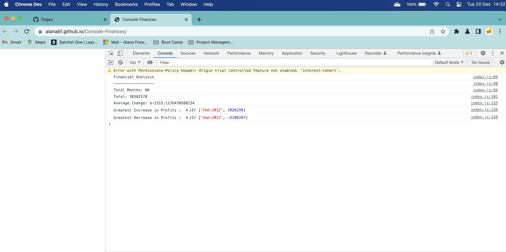

# Console-Finances

## Description

Given a dataset composed of arrays with two fields, Date and Profit/Losses I have written JavaScript code that analyzes the records to calculate each of the following:

* The total number of months included in the dataset.

* The net total amount of Profit/Losses over the entire period.

* The average of the **changes** in Profit/Losses over the entire period.
  * The total change in profits have been tracked from month to month and then the average found.
  * (`Total/Number of months`)

* The greatest increase in profits (date and amount) over the entire period.

* The greatest decrease in losses (date and amount) over the entire period.

When you open the code in your browser the resulting analysis looks similar to the following:

  ```text
  Financial Analysis
  ----------------------------
  Total Months: 25
  Total: $2561231
  Average  Change: $-2315.12
  Greatest Increase in Profits: Feb-2012 ($1926159)
  Greatest Decrease in Profits: Sep-2013 ($-2196167)
  ```

The final code prints the analysis to the console.

<https://alanabf.github.io/Console-Finances/>

## Installation

N/A

## Usage

Javascript code is used to analyse the records and calculate financial data. There will be nothing showing on the deployed web page, you will need to go to the console to see the analysis.



## Credits

N/A

## License

MIT

---
